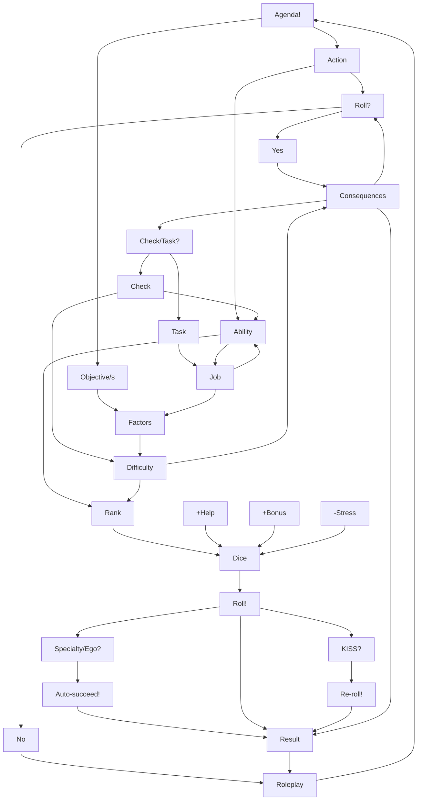

---
alias:
  - play procedure
  - quick play
tags:
  - creativecommons
  - rolls
  - summary
author: Seraaron
license: CC BY 4.0
date created: 2021-07-21+1400
last updated: Friday 2021-09-24 @ 23:02:26 (UTC+0100)
date updated: '2021-10-05T01:13:25+01:00'

---

> #quote
> _**Cower not from rolling your dice**, for only by doing so may you seize your destiny!_
>
> — **Joshua A C Newman**, [The Bloody-Handed Name of Bronze](https://glyphpress.com/talk/2017/what-is-the-bloody-handed-name-of-bronze)

---

###### _Quick Rolling Procedure_

[[Agora]] primarily uses a [pool of six-sided dice](https://en.wikipedia.org/wiki/Dice_pool) to _simulate randomness_ in play, to perform _non-trivial actions_, and to _resolve conflicts_ generated by the fiction.

**Use the following steps to get up-to-speed any time you need to roll dice:**

1. [[Agenda|Find your agenda]], and turn it into _an action and objective(s)_.

2. **Assuming [[When to roll dice|you should even roll]]**; discuss the [[Determining Difficulty and Consequences|consequences]], which [[Abilities|ability]] to use, and whether this roll should be a  [[Checks vs. Tasks|Check or a Task]]:
   - **Gather three dice, minus any [[Stress|stress]], if it's a [[Checks|Check]]**.
     - Roll separately if you're acting as a [[Checks#Group Checks|group]].
   - **Gather your [[Jobs|Job dice]] for a [[Tasks|Task]]**, and any other _situational bonuses_ or [[Assets and Gear|asset dice]].
     - _[[Fate's Offering|Spend dice before rolling]]_, if you can afford to, to guarantee the success of any side objectives.
   - **Get [[Helping|help]] if you need it**, or if it's offered; and roll the helping die separately (using the ability rank of the helper).

3. Roll the dice, and **count a success for each die that lands on a face _equal to or more than_ its [[rank]]**.
   - **For Checks** — you may spend use a relevant [[Specialties|specialty]] or spend [[Ego]], _to auto-succeed_.
   - **For Tasks** — you may [[KISSing|KISS]] any dice that fail you, _to re-roll them_.

4. Success or failure is determined by the [[Determining Difficulty and Consequences|difficulty]] of the roll:
   - **For Checks** — you must get 1 to 3 successes to pass, depending on whether the difficulty was 'easy', 'normal', or 'hard' (respectively).
   - **For Tasks** — you must meet or exceed the number of difficulty factors with successes to pass.

5. [[Let the dice rest|Let the dice rest where they may...]] and continue roleplaying.

---

%%
##### Gameplay Loop:

%%