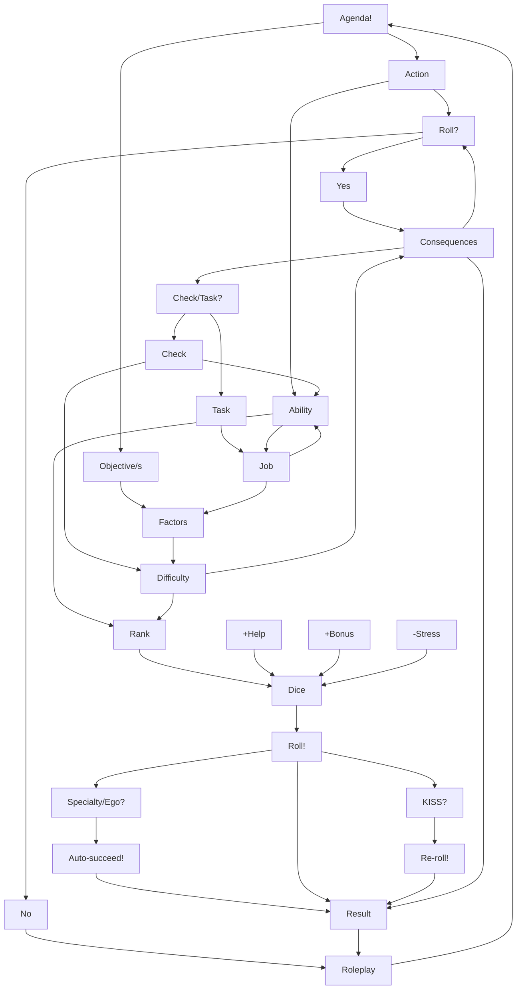

---
alias:
  - play procedure
  - quick play
tags:
  - CC-BY
  - rules
  - summary
author: Seraaron
license: CC BY 4.0
date created: 2021-07-21+1400
date updated: 2021-11-05 19:54

---

### *Quick Rolling Procedure:*

[[Agora]] primarily uses a [pool of six-sided dice](https://en.wikipedia.org/wiki/Dice_pool) to *simulate randomness* in play, to perform *non-trivial actions*, and to *resolve conflicts* generated by the fiction.

**Use the following steps to remind you how to play any time you need to roll dice:**

1.  [[Agenda|Find your agenda]], and turn it into *an action and objective(s)*.

2.  **[[When to roll dice|Assuming you should even roll]]**, discuss the [[Difficulties and Consequences|consequences]], which [[Abilities|ability]] to use, and whether this roll should be a  [[Checks vs. Tasks|Check or a Task]]:
    -   **For [[Checks]] — Gather three dice**
        -   Add dice from *one* relevant [[Assets and Gear|asset or peice of gear]], if any.
        -   Minus any [[Stress|stress]] in the ability you're using.
    -   **For [[Tasks]] — Gather your [[Jobs#Levels in Context|Job dice]]**
        -   Add dice from *any* relevant [[Assets and Gear|assets or gear]].
        -   Add bonus dice from any other sources or special advantages.
        -   Minus any [[Stress|stress]] in the ability you're using.
    -   **Ask for [[Helping|help]] if you need it**, or if it's offered.

3.  **Roll the dice!**

4.  **Count a success for each die that *equals or exceeds your [[Rank|ability rank]]***.
    -   You may [[KISSing|KISS]] any dice that fail you — using [[Kismet]] or [[KISSing#Insight|Insights]], by [[KISSing#Stunts|Stunting]], or with the aid of your [[Specialties]] — *to re-roll them*.

5.  Whether you pass or fail depends on the [[Checks vs. Tasks|type of roll]] and the number of successes that you rolled:
    -   **For [[Checks]] — You must get *2 successes* to pass**.
        -   1 success  means *failure with a twist* — You don't get what you want, *but* something interesting happens.
        -   3+ successes is an *exceptional pass* — You get what you wanted, *and* something unexpected happens.
    -   **For [[Tasks]] — You must get *successes ≥ [[Generic Difficulty Factors|difficulty factors]]* to pass**.
		-   Each difficulty factor represents an objective to complete, a problem to solve, or an obstacle that stands in your way.
		-   *Margin of failure* indicates how close you came to success, and which obstacles were overcome, but your agenda is ultimately unfulfilled.
	- **If you failed the roll and it was deemed [[Stressful Rolls|stressful]]**, then take a point of stress in the ability you rolled with.
6.  **[[Let the dice fall where they may|Let the dice rest where they may]]**, end your [[Session Structure#Turns|turn]], and continue roleplaying.

---

-   **Next article:** [[Quick Session Plan]]
-   **Previous article:** [[Introduction]]

%%

##### Gameplay Loop:

%%
